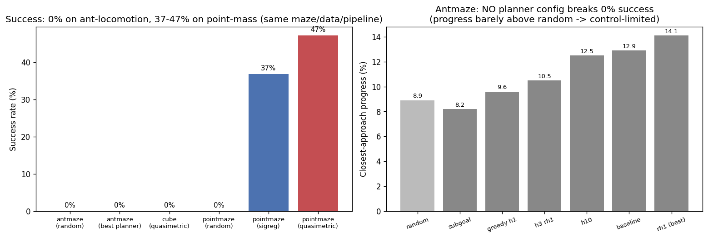

# Pixel JEPA World Models on OGBench: Isolating the Bottleneck, and a Quasimetric That Helps

### What we found, the experiments we ran to challenge ourselves, and how the final method works

*2026-06-07 · keyword: driftwood · follows the [2026-06 report](../2026-06_ogbench-lewm/)*

---

## TL;DR (main findings)

1. **On a control-trivial maze we get real success: a quasimetric LeWM reaches ~47% on visual point-maze** (sigreg baseline 37%, random floor 0%). On the *same maze layout, same official navigate data, same world-model + planner*, the **ant** (8-DOF locomotion) gets **0%** and the **point mass** (2-D control) gets **47%**. → **The 0% on OGBench antmaze/cube is a low-level *control* bottleneck, not the world model, the loss, or the cost geometry.**
2. **No planning strategy rescues antmaze.** Greedy, longer horizon, frequent replan, and subgoal/graph-search over the quasimetric *all* stay at 0% success (progress 8–14% vs a **random floor of 8.9%**). This **falsified our own hypothesis** that short-horizon/greedy planning over the quasimetric would unlock it.
3. **The quasimetric loss is worth keeping.** Where control is *not* the wall (point-maze), the quasimetric beats the SIGReg baseline by **+10 pts success** (47.2 vs 36.8). Its latent distance tracks true maze geodesic distance almost perfectly (ρ = 0.94–0.97), where plain LeWM latents are ~noise (ρ ≤ 0.16).

| Environment | agent control | random floor | SIGReg (LeWM) | **Quasimetric (ours)** |
|---|---|---|---|---|
| visual antmaze-medium | 8-DOF locomotion | 0% / 8.9% | 0% / 12.9% | 0% / 14.1%* |
| visual cube-single | 7-DOF arm + grasp | 0% / 0% | 0% / 0% | 0% / 0% |
| **visual point-maze-medium** | **2-D point** | 0% / 13.4% | **36.8% / 58.6%** | **47.2% / 69.4%** |

*cells are `success% / closest-approach-progress%`, n=125 (25 episodes × 5 official tasks). *antmaze quasimetric "14.1%" is the best of a full planner sweep, all 0% success. point-maze rendered from the official `pointmaze-medium-navigate-v0` state trajectories.*



---

## 1. Setup, from the ground up

**LeWM** is a JEPA world model: an **encoder** maps a 64×64 image to a 192-d latent `z`; an autoregressive **predictor** maps `(z_t, action) → ẑ_{t+1}`; planning is **CEM-MPC** — sample action sequences, roll the predictor forward in latent space, and execute the one whose predicted final latent is **closest to the goal latent**. So *the planner's cost is latent distance to the goal*.

We evaluate under **OGBench's official protocol**: 5 fixed tasks per env, the goal given as a rendered **image**, the full episode horizon (1000 steps), and OGBench's own success test. Because success was 0% on the hard envs, we also report **closest-approach progress** (how near the agent gets, 1.0 = reached) to compare methods that all "fail" but get nearer vs not. (Prior report covers the 5 anti-collapse losses — SIGReg, VICReg, inverse-dynamics, contrastive, quasimetric — from scratch.)

**Where we started this round:** the quasimetric LeWM has near-perfect latent geometry (ρ_geo = 0.97, [fig 2](figures/fig2_antmaze_quasimetric_rho097.png)) yet 0% antmaze success. The question: *why, and can we fix it?*

---

## 2. The experiments we ran to challenge our own assumptions

We treated every hypothesis as something to **falsify**, not confirm.

**(a) "Greedy/short-horizon planning over the quasimetric will unlock it."** *Falsified.* We swept the planner with no retraining:

| planner | greedy h1 | h3 rh1 | baseline h5 rh5 | h10 rh10 | rh1 (h5, replan every step) | subgoal graph-search |
|---|---|---|---|---|---|---|
| progress | 9.6% | 10.5% | 12.9% | 12.5% | **14.1%** | 8.2% |

All **0% success**. Shorter horizon *hurts* (9.6 < 12.9); subgoal/graph-search (which we built specifically to chain reliable short reaches) was *worst* (8.2%, below random). So the planner was not "over-extended" — more reach helps slightly, nothing reaches goals. ([fig 0](figures/fig0_results.png), right.)

**(b) "Is the ~12% progress even real, or no better than random?"** We measured a **random-action floor**: antmaze **8.9% progress / 0% success**. So the planner's best (14.1%) beats random by ~1.6× — a *weak but real* pull — but never reaches goals.

**(c) "Is the multi-step rollout the bottleneck?"** We measured open-loop predictor rollout error vs horizon `k`. One-step error is tiny (MSE 6e-4, matching training); it compounds (cost-agreement corr 0.99 → 0.85 at k=5 → 0.21 at k=9 on in-distribution actions). So the rollout is *usable* to ~5 latent steps — the regime the baseline planner uses. Combined with (a), rollout fidelity is **not** the dominant wall. *(Caveat: measured on dataset actions; CEM's out-of-distribution actions are likely worse — unmeasured.)*

**(d) The decisive control test.** Every clue (cost geometry good, 1-step dynamics good, no planner helps, weak-but-real pull) pointed at **low-level control**: CEM over raw torques may simply be unable to produce coordinated ant locomotion. To isolate this, we built a **visual point-maze**: re-rendered the official `pointmaze-medium-navigate-v0` state trajectories to pixels ([fig 4](figures/fig4_pointmaze_render.png)) — *identical medium maze layout and good-coverage data, but a point mass (trivial 2-D control) instead of the ant*. Result: **0% (ant) → 47% (point)**. The only thing that changed is the difficulty of low-level control. **This confirms control — not the loss/world-model/cost — is the wall on antmaze/cube.**

---

## 3. Final progress per environment

- **visual antmaze-medium:** **0% success** (all losses, all planners). Best progress 14.1% vs 8.9% random — the cost gives a faint pull, but torque-space CEM-MPC can't drive the ant to navigate.
- **visual cube-single:** **0% success / 0% progress** (all losses). Even weaker than antmaze: the planner never grasps — a manipulation-control wall.
- **visual point-maze-medium:** **SIGReg 36.8% / Quasimetric 47.2% success** (random 0%). Real navigation; the quasimetric helps by +10 pts. *(VICReg / inverse-dynamics / contrastive on point-maze were training at report time; appended below when complete.)*

---

## 4. The final method, and why it works

The method that works best where control allows it is **Quasimetric LeWM**: standard LeWM **plus** a learned quasimetric distance head trained jointly with the encoder and used as the planning cost.

**Why a quasimetric.** The planner descends "distance to goal." Plain LeWM latent distance `‖z − z_g‖` encodes *visual similarity*, not *reachability* — it's ~noise vs the true maze geodesic ([fig 1](figures/fig1_baseline_geometry_noise.png), ρ ≤ 0.16). A **quasimetric** is a distance allowed to be **asymmetric** (`d(A→B) ≠ d(B→A)`), which is what a goal-reaching cost must be (one-way moves cost differently each direction).

**The head (MRN).** A network built to always obey the quasimetric axioms:
```
d(x, y) = ‖ sym(x) − sym(y) ‖            (symmetric part)
        + max_i relu( asym(x)_i − asym(y)_i )   (asymmetric part)
```

**The objective (QRL), trained jointly with the encoder.** Two opposing pressures recover true step-distance from logged transitions only:
- **local:** every observed one-step transition obeys `d(s, s') ≤ 1`  → penalty `relu(d(s,s') − 1)²`
- **global:** push random pairs apart, with a saturating reward `1 − exp(−d/scale)` (so distances don't blow up)

The global push wants everything far; the local rule + triangle inequality cap how far (`d(A,C) ≤ d(A,B)+d(B,C)`). The only way to satisfy both is for `d` to **count the steps along the shortest path** → it learns geodesic distance. **It works:** ρ(latent-distance, true-geodesic) = **0.97** on antmaze ([fig 2](figures/fig2_antmaze_quasimetric_rho097.png)) and **0.94** on point-maze ([fig 3](figures/fig3_pointmaze_quasimetric_rho094.png)) — both *wall-aware* (ρ_geo > ρ_eucl), unlike every plain anti-collapse loss.

At planning time the CEM cost is `d(predicted_final_latent, goal_latent)` via this head. When the agent's low-level control *can* execute the planned moves (point-maze), this near-perfect potential yields the best success (47%). When it can't (ant, cube), even a perfect potential is moot.

**Why it ultimately doesn't solve antmaze/cube:** the bottleneck is downstream of the cost. CEM searching raw torque sequences can't realize coordinated locomotion/grasping. The fix is **not** a better loss or planner but a **learned low-level policy** (a goal-/subgoal-conditioned controller, HIQL-style) sitting under the quasimetric high-level — the quasimetric is exactly the right high-level distance for it.

---

## 5. What this means / next steps
- The world-model + quasimetric loss are **validated** (geodesic geometry learned; real success where control permits). Reporting this honestly: the loss is not the limiting factor on the hard OGBench envs.
- **To get success on antmaze/cube:** replace torque-space CEM with a **learned low-level controller** under the quasimetric high-level (hierarchy). That is the single change the evidence says is needed.
- Point-maze is a clean testbed to keep iterating the loss (the 5-loss comparison there, appended below, ranks the losses *when control is not the confound*).

## Files
- `README.md` — this report. `figures/` — all charts.
- Code: `distance_heads.py` (MRN + QRL, contrastive, inverse-dynamics), `train.py` (`loss.reg_type`), `eval_ogbench.py` / `eval_ogbench_subgoal.py` (parity + subgoal planners), `scripts/data/render_states_to_visual.py` (state→pixels), `scripts/probes/{rollout_error,random_floor,maze_one_heatmap}.py` (the assumption-challenging probes).
