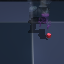
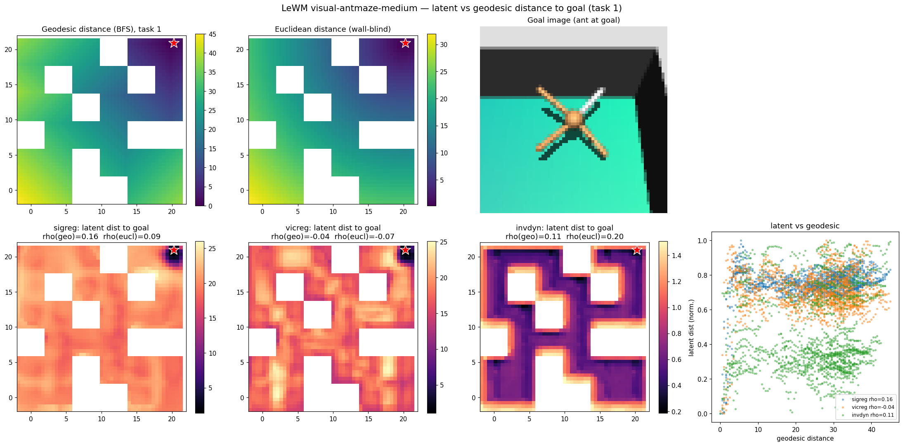
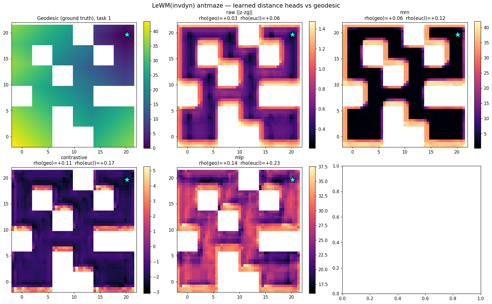
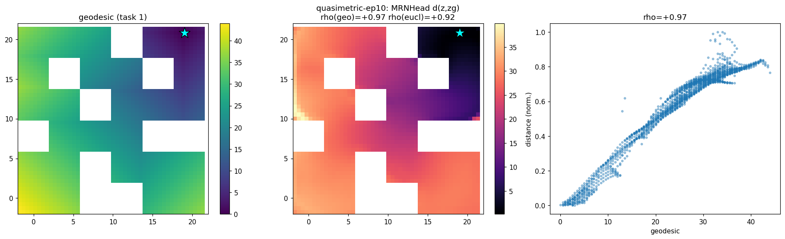
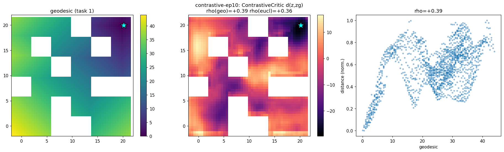
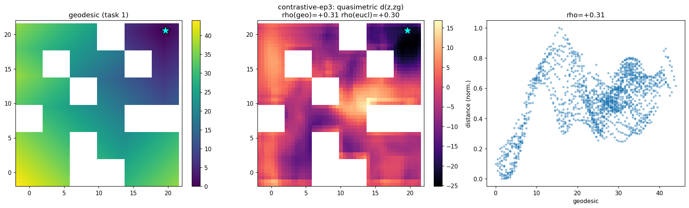

# A Pixel JEPA World Model on OGBench
### What we built, the five training losses explained from scratch, and what we found

*June 2026 · LeWM × OGBench (visual)*

This report is written to be self-contained: it explains every piece from the ground up,
spends most of its length on the **five loss functions** (with formulas, tiny worked
examples, and what one gradient-update step does), and ends with the factual findings and
all the figures.

---

## 1. The world model, from the ground up

**Image → latent.** The model's *encoder* takes a 64×64 camera image and outputs a vector
`z` of 192 numbers, called the **latent** (or embedding). Think of `z` as a compressed
summary of the scene — ideally encoding things like where the ant is in the maze. A
**batch** is `B` images processed at once; their latents stack into a `B × 192` table.

**Predicting the future.** A second network, the *predictor*, takes the current latent and
an action and outputs a guess for the *next* latent. It is trained with the **prediction
loss**:

```
L_pred = average over the batch of  || predictor(z_t, action_t) − z_{t+1} ||²
```

where `||v||² = sum of the squared entries of v` (how far apart two 192-vectors are). In
words: *"make your prediction of the next latent match the real next latent."*

**How it acts (planning).** To reach a goal given as an image, the model encodes the goal to
`z_goal`, then imagines many action sequences, predicts where each one lands in latent
space, and executes the sequence whose predicted final latent is **closest to `z_goal`**
(smallest `||· − z_goal||`). This is CEM-MPC. The key thing to remember: **the planner's
cost is latent distance to the goal.** If that distance is meaningful, planning works; if
not, it doesn't.

**Gradient descent (one sentence).** Training repeatedly nudges every network weight a tiny
step in the direction that most reduces the total loss. "The update step" in each section
below just means: *which way does this loss nudge the latents?*

**The collapse problem.** `L_pred` alone has a cheat: make the encoder output the **same
vector for every image**. Then the predictor trivially predicts that constant, `L_pred = 0`
— but the latent is useless (it forgot the image). To prevent this we add a **regularizer**:
an extra loss term that rewards the latents for being spread out and well-structured.

```
total loss = L_pred  +  weight × regularizer
```

**This report compares five choices of that regularizer** — five different ideas of what
"good structure" should mean. The first (SIGReg) is LeWM's original; the other four are the
ones we added.

---

## 2. The five loss terms

> Each section: **what it computes → intuition → tiny example → the update step → why we chose it.**
> Notation: `z` = a latent (192 numbers); `relu(x) = max(0, x)`; `std` = standard deviation
> (spread) of a set of numbers.

### 2.1 SIGReg — "make the cloud of latents look like a bell curve" *(baseline)*

**What it computes.** A collapsed set of latents is clumped at a point; a healthy set fills
space in all directions. SIGReg measures how far the latent cloud is from a **standard
Gaussian** (bell-curve) shape and penalizes the gap. Mechanically: it picks many random
directions, projects all latents onto each (collapsing the 192-D cloud to a 1-D histogram),
and compares each histogram to a Gaussian with a tool called the Epps–Pulley statistic.

**Intuition.** "Be spread out, in a bell-shaped, all-directions way."

**Tiny example.** If all latents are identical, every projection is a single spike — nothing
like a bell curve — so the penalty is large. If they already look Gaussian, the penalty ≈ 0.

**The update step.** Pushes latents apart to evenly fill space in a Gaussian shape.

**Why it's the baseline.** It is what the published LeWM uses. It reliably prevents collapse,
but it is *shape-prescriptive*: it forces one specific (Gaussian) shape regardless of the task.

### 2.2 VICReg — "every coordinate must vary, and not duplicate its neighbors"

**What it computes.** Two parts, both on the `B × 192` table of latents:

- **Variance term.** For each of the 192 columns, compute its `std` across the batch. If a
  column's `std` falls below 1, penalize it by `relu(1 − std)`. → no single coordinate is
  allowed to collapse to a constant.
- **Covariance term.** Form the `192 × 192` covariance matrix (how each pair of coordinates
  co-varies) and penalize the **off-diagonal** entries (squared). → different coordinates are
  pushed to be uncorrelated, so each carries *distinct* information instead of duplicating.

```
regularizer = 25 · mean_j relu(1 − std_j)   +   1 · ( sum of off-diagonal cov² ) / 192
```

**Tiny example (variance).** If coordinate 5 has `std = 0.3`, its penalty is
`relu(1 − 0.3) = 0.7`, times the weight 25 = **17.5** — a big push to spread it out. A
coordinate with `std = 1.2` gives `relu(1 − 1.2) = 0` — already fine, no push.

**Tiny example (covariance).** If coordinate 3 always equals coordinate 7 (redundant),
`cov(3,7)` is large → its squared penalty pushes the encoder to make them differ.

**The update step.** The variance gradient stretches the batch out along any squashed axis;
the covariance gradient decorrelates axes so they stop mirroring each other.

**Why we chose it.** It is a *weaker, shape-agnostic* anti-collapse than SIGReg — it never
dictates a distribution, only "don't squash, don't duplicate." The hope: less distortion of
task structure, plus decorrelation nudges toward a *factorized* code (distinct coordinates =
distinct factors, e.g. x-position vs. y-position).

### 2.3 Inverse-Dynamics — "the latent must reveal which action was taken"

**What it computes.** A small extra network (a "head") reads two consecutive latents
`(z_t, z_{t+1})` and tries to output the action `a_t` that caused that transition:

```
regularizer = || head(z_t, z_{t+1}) − a_t ||²
```

**Intuition.** To name the action from the before/after latents, the latents must encode
whatever the action *changes* — the **controllable** parts of the world (the ant moving, a
block being pushed). Things actions don't affect (e.g. background) can be ignored. So the
latent is pressured to keep exactly the controllable information.

**Anti-collapse for free.** If all latents are identical, `(z_t, z_{t+1})` carries no
information, the head can't tell which action happened, the loss stays high → the encoder is
forced to make consecutive latents differ in action-revealing ways.

**Tiny example.** Ant takes "push right" → `z_t` and `z_{t+1}` differ (ant shifted) → the head
reads the difference and outputs "right." If the encoder had collapsed (`z_t = z_{t+1}` for
every transition), the head sees the same input every time, outputs one fixed guess, and is
wrong on most transitions → high loss.

**The update step.** Gradient flows back through the head into the **encoder**, nudging it to
make consecutive latents differ in a way that cleanly decodes to the action.

**Why we chose it.** It ties the representation directly to **controllability**, and
controllable = reachable = goal-relevant. The most task-grounded of the five.

### 2.4 Contrastive (InfoNCE / CRL-style) — "match each state to its own future, not someone else's"

**What it computes.** Two small networks `f` and `g`. A compatibility *score* between a
state and a goal is the dot product `score(z_s, z_g) = f(z_s) · g(z_g)` (higher = more
compatible). In a batch of `B` pairs `(state, its real future-goal)`, form the `B × B` score
matrix between every state and every goal. The correct matches are on the diagonal. Train
with softmax **cross-entropy** so each state scores highest with *its own* future (and
symmetrically per column).

**Intuition.** This pulls together latents that actually occur near each other in time (a
state and its true future) and pushes apart unrelated ones (a state and a random goal). The
resulting geometry encodes "can you get from here to there" = reachability. The other goals
act as *negatives* that make collapse impossible.

**Tiny example.** Batch of 3 pairs → a `3 × 3` score matrix; we want the diagonal to be
biggest. If the encoder collapses, every score is equal, softmax is uniform (`1/3` each), and
cross-entropy is at its worst value `ln 3 ≈ 1.10` → a strong push to differentiate.

**The update step.** The cross-entropy gradient raises the matched (diagonal) scores and
lowers the mismatched (off-diagonal) ones, adjusting `f`, `g`, and the encoder.

**Why we chose it.** Contrastive RL (CRL) is the strongest *published* method on visual
OGBench, and "distance = −score" is a natural reachability cost.

### 2.5 Quasimetric (MRN head + QRL objective) — "make latent distance equal the number of steps to get there"

**First, what is a quasimetric?** A distance allowed to be **asymmetric**: `d(A→B)` need not
equal `d(B→A)`. Why we want that: with one-way moves (drop off a ledge — easy down, hard up)
the cost to reach depends on direction, so an ordinary symmetric distance literally cannot
represent it. A goal-reaching distance is naturally a quasimetric.

**The MRN head.** A network *built* to always obey the quasimetric rules (`d(x,x)=0`, the
triangle inequality, and asymmetry). It computes:

```
d(x, y) = || sym(x) − sym(y) ||                      (symmetric part: same both directions)
        + max over coordinates i of relu( asym(x)_i − asym(y)_i )   (asymmetric part)
```

The asymmetric term changes when you swap `x` and `y` (giving asymmetry), and the
max-of-relu form provably keeps the triangle inequality.

**The QRL objective (the clever part).** We want `d` to equal the true number of steps
between states, using only logged transitions. Two opposing pressures:

- **Local:** for every observed one-step transition `s → s'`, require `d(s, s') ≤ 1` (one step
  costs at most 1). Coded as penalty `relu(d(s, s') − 1)²`.
- **Global:** for random pairs `(s, g)`, **push `d(s, g)` as large as possible** — but with
  diminishing returns so it saturates rather than exploding (reward `= 1 − exp(−d / scale)`,
  which we maximize).

```
regularizer = −( 1 − exp(−d(s, g_random)/scale) )   +   25 · relu( d(s, s') − 1 )²
              \_______ push pairs apart _______/        \____ keep each step ≤ 1 ____/
```

**Why this recovers true distance.** The global push wants everything far apart, but the
local rule plus the triangle inequality *cap* how far things can be:
`d(A,C) ≤ d(A,B) + d(B,C)`. The only way to make distant states maximally far while every
single step stays ≤ 1 is to make `d` **count the steps along the shortest path**.

**Tiny example (a 3-node chain A → B → C, with transitions A→B and B→C observed).**
- Local rule forces `d(A,B) ≤ 1` and `d(B,C) ≤ 1`.
- The global push wants `d(A,C)` large; the triangle inequality caps it:
  `d(A,C) ≤ d(A,B) + d(B,C) ≤ 2`. The push saturates it at the cap → **`d(A,C) = 2`**, the
  true number of steps. The metric learned the path length without ever being told it.

**The update step.** Each iteration samples (i) real transitions — if their `d` exceeds 1,
the penalty pulls it down; and (ii) random pairs — the reward nudges their `d` up until it
saturates. Over training, one-hop distances shrink to ≤ 1 and long-range distances grow to
the sum of hops.

**Why we chose it.** The planner's entire job is "minimize latent distance to the goal." If
that distance *equals* "steps to the goal," planning becomes simple downhill descent. It
directly targets the thing the diagnostic (§4) shows is broken.

> **Post-hoc vs. joint.** Each new *distance* idea (2.4, 2.5) can be trained two ways:
> **post-hoc** = freeze the already-trained encoder and train only the new head on top; or
> **joint** = train the encoder *together* with the head. The figures label which.

---

## 3. How we measured everything

- **OGBench-parity evaluation.** We use OGBench's official rules so numbers are comparable to
  its public leaderboard: its **5 fixed tasks**, the goal supplied as a **photo** (a rendered
  image of the goal state), the **full episode length** (1000 steps for antmaze), and its own
  **success test** (did the agent physically reach the goal). *Success* = % of episodes that
  reach the goal. We first verified the simulator renders the same frames as the official
  dataset, so the encoder sees in-distribution images (**Fig 0**).
- **Progress metric.** Because success was 0% everywhere, we also report how *close* the agent
  got, as a fraction of its starting distance (1.0 = reached, 0 = no closer). It separates
  methods that all "fail" but get nearer vs. not.
- **Latent-geometry heatmap (the key diagnostic).** Fix a goal; for every free cell of the
  maze, place the agent there, encode the image, and measure the (latent or learned) distance
  to the goal's latent. Plot it, and compare to the **true geodesic distance** (shortest path
  through the maze, respecting walls). Agreement is summarized by **Spearman ρ**, a
  rank-correlation in `[−1, 1]`: `ρ = 1` means the latent distance orders positions exactly
  like true reachability; `ρ ≈ 0` means unrelated.


*Fig 0a. Simulator-rendered frame.* &nbsp; (compare to Fig 0b below)


*Fig 0b. Official-dataset frame at the same state — visually identical, confirming the encoder sees in-distribution images.*

---

## 4. Main findings

| Method (antmaze-medium, visual) | ρ(latent, geodesic) | Progress | Success |
|---|---|---|---|
| VICReg | ≈ 0 | 8.2% | 0% |
| SIGReg (LeWM baseline) | 0.16 | 9.0% | 0% |
| Inverse-Dynamics | ~0.11 | 10.1% | 0% |
| Joint contrastive / CRL | 0.39 | 11.9% | 0% |
| **Joint quasimetric / QRL** | **0.97** | **12.9%** | 0% |

*All numbers `n = 125` (25 episodes × 5 tasks). Reference points (published): value-based
methods CRL 94% / HIQL 93% success on this visual task; the comparable world-model-MPC
precedent (TD-MPC2 run offline) is 0%. On visual cube-single, all of our variants are 0%
success / 0% progress.*

1. **Under the official protocol, every variant scores 0% success** on both antmaze and cube.
2. **Baseline latent distance barely tracks reachability** — `ρ_geo ≤ 0.16` for all three
   anti-collapse losses (**Fig 1**); the cost the planner descends is close to noise. Among
   the three, progress orders InvDyn (10.1%) > SIGReg (9.0%) > VICReg (8.2%).
3. **Distance heads trained post-hoc on a frozen encoder stay weak** — `ρ_geo ≤ 0.14`
   (**Fig 2**).
4. **Trained jointly with the encoder, the quasimetric reaches `ρ_geo = 0.97`** and is
   *wall-aware* (`ρ_geo > ρ_eucl`), i.e. its distance respects the maze walls, not just
   straight-line position (**Fig 3**); the contrastive critic reaches `ρ_geo = 0.39`
   (**Fig 4**; **Fig 5** shows it already at 0.31 only 3 epochs into joint training). Their
   planning **progress is the best measured** (quasimetric 12.9%, contrastive 11.9%) — yet
   **success is still 0%**: latent geometry improved ~6× (`ρ` 0.16→0.97) while progress
   improved ~1.4× (9→12.9%).


*Fig 1. Top: true geodesic (left) and Euclidean (right) distance to the goal (★). Bottom:
latent distance for SIGReg / VICReg / Inverse-Dynamics — speckled, `ρ_geo ≤ 0.16`.*


*Fig 2. Distance heads (MRN / contrastive / MLP) trained on a frozen encoder vs. geodesic:
they beat raw latent distance but plateau at `ρ_geo ≤ 0.14`.*


*Fig 3. Jointly-trained quasimetric (MRN + QRL), epoch 10: the learned distance (middle) is
nearly identical to the geodesic (left); `ρ_geo = 0.97`, and `ρ_geo > ρ_eucl` (wall-aware).*


*Fig 4. Jointly-trained contrastive (CRL-style) critic, epoch 10: `ρ_geo = 0.39`.*


*Fig 5. The same contrastive run only 3 epochs in: `ρ_geo = 0.31` — a goal-centered basin
already forming (vs. ≤ 0.16 for any frozen/post-hoc result).*

---

## Files
- `README.md` — this report (renders on GitHub with the figures inline).
- `figures/` — all figures (Fig 0a/0b render-parity, Fig 1–5).

*Code that produced these (currently on `main`): `distance_heads.py` (the MRN quasimetric,
contrastive critic, and their objectives), `train.py` (`loss.reg_type ∈
{sigreg, vicreg, invdyn, quasimetric, contrastive}`), `eval_ogbench.py` (the parity eval +
progress metric), and `scripts/probes/maze_*heatmap.py` (the latent-geometry diagnostic).*
